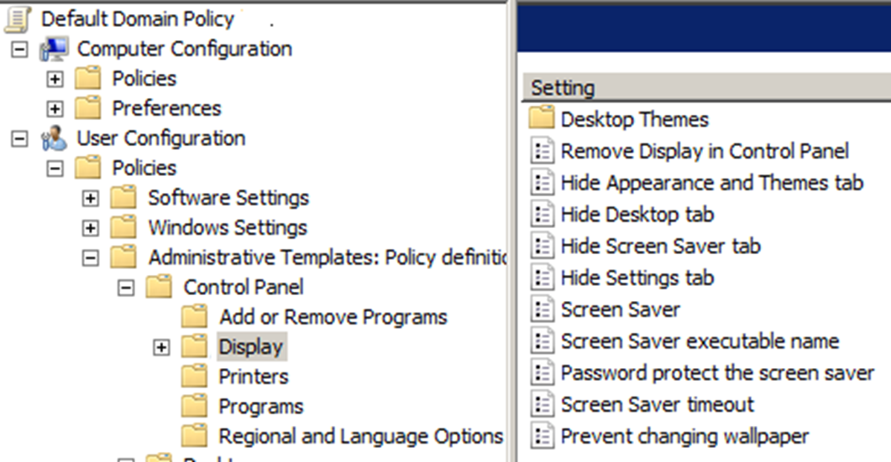

# Continuation from slide 44 of lecture 4 slides (theory)  

# Objectives
Intro to GP  

# Supplimentary video for GPO precedence
[link](https://www.youtube.com/watch?v=orQns7K-brM)

# Navigation
* [Intro to GP](#introduction-to-group-policy-gp)
* [Securing Win Server 2016 using Security Policies](#win-server-2016-using-security-policies)
* [Establishing Account policies](#establishing-account-policies)
* [Establishing Audit policies](#establishing-audit-policies)
* [Configuring User Rights](#configuring-user-rights)
* [Configuring Security Options](#configuring-security-options)
* [List of settings under "User Configuration"](#list-of-settings-under-user-configuration)

 

## Introduction to Group Policy (GP)

GP in Win Server 2016 allows standardization of working environment of clients and servers via policies in AD.   

### Characteristics of GP

* Can be set for a <b>site</b>, <b>domain</b>, <b>OU</b>, or <b>local computer</b>
* Cannot be set for non-OU folder containers
* Settings are stored in GPO
* GPOs can be local and nonlocal
* Can be set up to affect all user accounts and PCs
* When GP is updated, old policies are removed or updated for all clients

 

PC configuration applies to computers  

User configuration applies to users  

 

## Win Server 2016 using Security Policies

Security policies are a subset of individual policies within a larger GP for a site, domain, OU, or local PC

 

Security policies
* <b>Account Policies</b>
* Audit Policy
* <b>User Rights</b>
* Security Options
* IP Security Policies (IPSec)
 

### Establishing Account Policies

Acc policies == all security measures set up in GP that applies to all accs or to all accs in a container when AD is installed.  

Acc policies affect 3 main areas. Password, Account, and Kerberos security.  
 

PW security
* 1 option is to set a pw expiration period, requiring users to change pws at regular intervals
* Some orgs require that all pws have a minimum length  
 

Specific pw security options
* Enforce pw history
* Max. password age
* Min. password age
* Min. password length
* Pws must meet complexity requirements
* Store pw using reversible encryption
 

Acc Lockout, where the OS can employ acc lockout to bar access to an account (including true account owner) after a number of failed login attempts

Lockout can be set to released after a specified period of time, or by intervention from the server admin

Common policy is to have a lockout after 5 to 10 failed logon attempts, admin can set lockout to release after a designated time

 

Acccount lockout parameters
* Acc lockout duration
* Acc lockout threshold
* Reset acc lockout count after
 

Acc Lockout is mainly used to prevent brute force attacks on passwords, but it can cause Denial of Service attacks
* With a lockout of 30 mins, an attacker can lockout all user accounts with incorrect pws to cause a DoS to the system via unable to login  
 

### Establishing Audit Policies

Examples of events an org can audit
* Account logon (and logoff) events
* Acc management
* Directory service access
* Logon (and logoff) events at the local computer
* Object access
* Policy change
* Privilege use
* Process tracking
* System events

Audit policies are a passive defensive measure (wait and see)
  

### Configuring User Rights

Enable an acc or grp to perform predefined tasks  

The most basic right is the ability to access a server, more advanced rights give privs to create accs and manager server functions

 

2 general categories of rights
* Privileges, relate to the ability to manage server or AD functions
* Logon rights, to how accs, PCs, and services are accessed
 

Becareful to not mix up user rights with permissions, e.g.
* Right to read from file vs perm to read from file
* Right to logon to server vs perm to logon to server
 

<b>Examples of privs</b> (* important)
* Add workstations to domain
* Back up files and directories
* Change system time
* Create permanent shared objects
* Generate security audits
* Load and unload device drivers
* Perform volume maintenance tasks
* Shutdown system

Perms may work with user rights side by side, some operational task may need both perm and user right to enable users to carry out tasks

 

Examples of logon rights
* Access this PC from network
* Allow logon locally
* Allow logon through Remote Desktop Services (RDP)
* Deny access to this PC from network
* Deny logon as a service
* Deny logon locally
* Deny logon through RDP

User rights is generally any option under "User Rights Assignment" from  
PC config -> Policies -> Windows Settings -> Security Settings -> Local Policies -> User Rights Assignment  
within GP management editor

 

### Configuring Security Options

Specialized security options divided into categories
* Accounts
* Audit
* DCOM
* Devices
* Domain Controller
* Interactive Logon
* Microsoft Network Client
* Network access
* Network security
* Recovery console
* Shutdown
* System cryptography
* System objects
* System settings
* User Account Control (UAC)

UAC is the most common feature a user can encounter out of the listed categories  
Right below "User Rights Assignment" in GP management editor

 

### List of settings under "User Configuration"

Further reference for user configurations of GP

Link: 